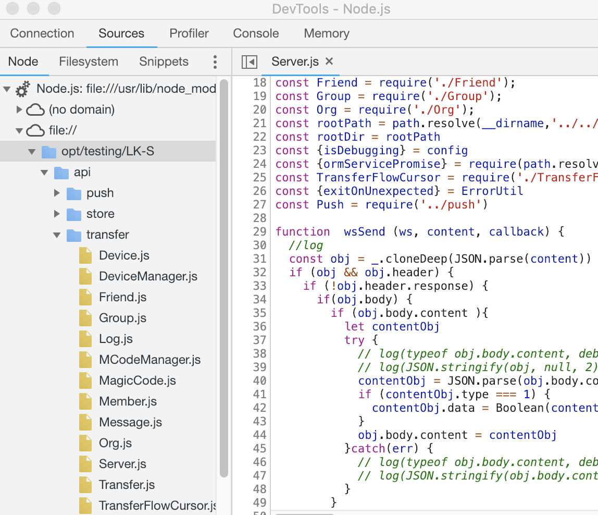

## pm2部署
```
 pm2 start api/transfer/Server.js --name=transfer --node-args="--inspect"
```

- 在默认端口9229调试

## 远程调试

1. ssh通过本地9221来转服务器9229调试端口
```

ssh -L 9221:localhost:9229 root@192.144.200.234

```

2. ssh连接建立后,打开chrome开发者工具


点击左上角node图标

3. 在新打开的devtool窗口**sources** tab进行调试

